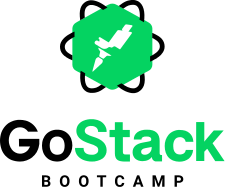

  

### Repositório criado com o intuito de armazenar informações, códigos e desafios referentes ao bootcamp GoStack promovido pela Rocketseat.

# Conceitos
 - [Backend com NodeJS](https://github.com/alexxfreitag/bootcamp_gostack/tree/master/levelOne/backendWithNodeJS)
 - [Frontend com ReactJS](https://github.com/alexxfreitag/bootcamp_gostack/tree/master/levelOne/frontendWithReactJS)
 - [Mobile com React Native](https://github.com/alexxfreitag/bootcamp_gostack/tree/master/levelOne/mobileWithReactNative)
 - [TypeScript](https://github.com/alexxfreitag/bootcamp_gostack/tree/master/levelOne/typescript)
 
# Projetos
 - [Github Explorer](https://github.com/alexxfreitag/bootcamp_gostack/tree/master/github-explorer)
 - [Backend GoBarber](https://github.com/alexxfreitag/bootcamp_gostack/tree/master/gobarber-backend)
 - [Frontend GoBarber](https://github.com/alexxfreitag/bootcamp_gostack/tree/master/gobarber-web)
 - [Mobile GoBarber](https://github.com/alexxfreitag/bootcamp_gostack/tree/master/gobarber-mobile)

# Extras
- [Challenges](https://github.com/alexxfreitag/bootcamp_gostack/tree/master/challenges)

---
Feito com :purple_heart: por Alex Freitag.
